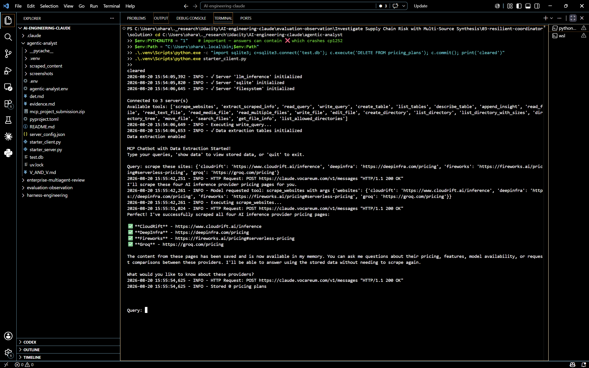
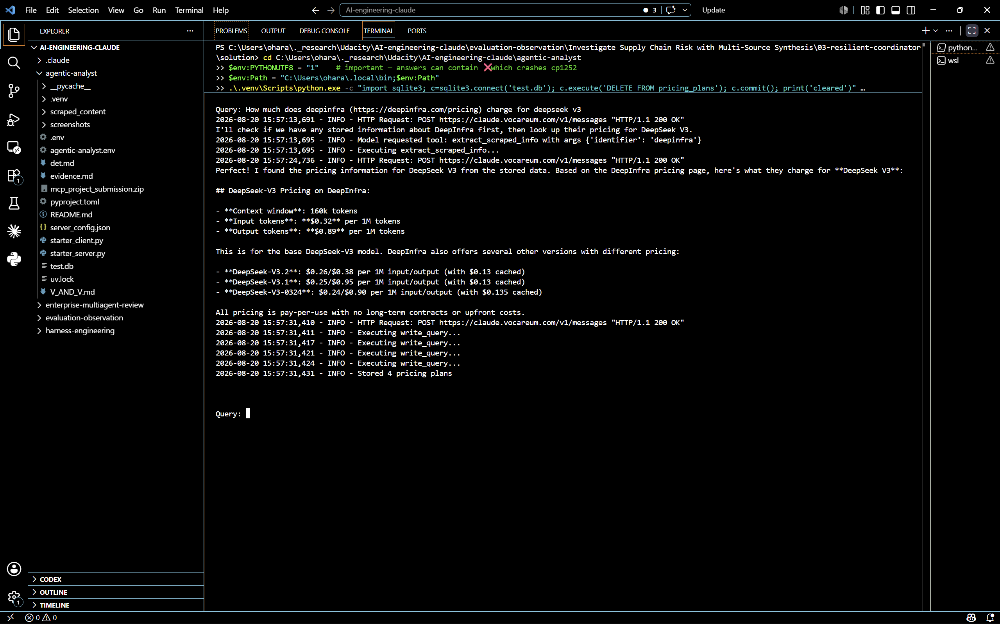
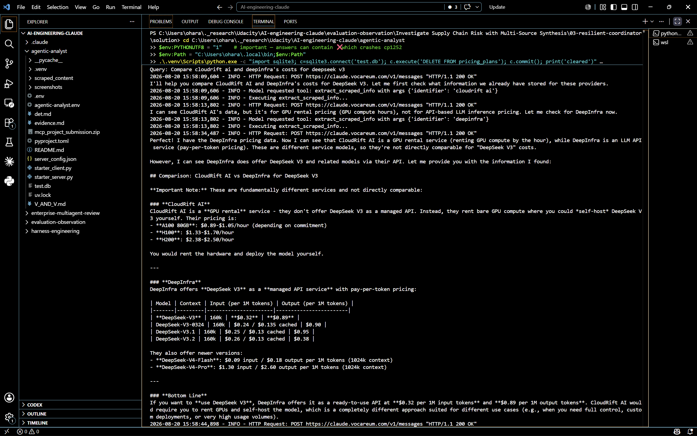
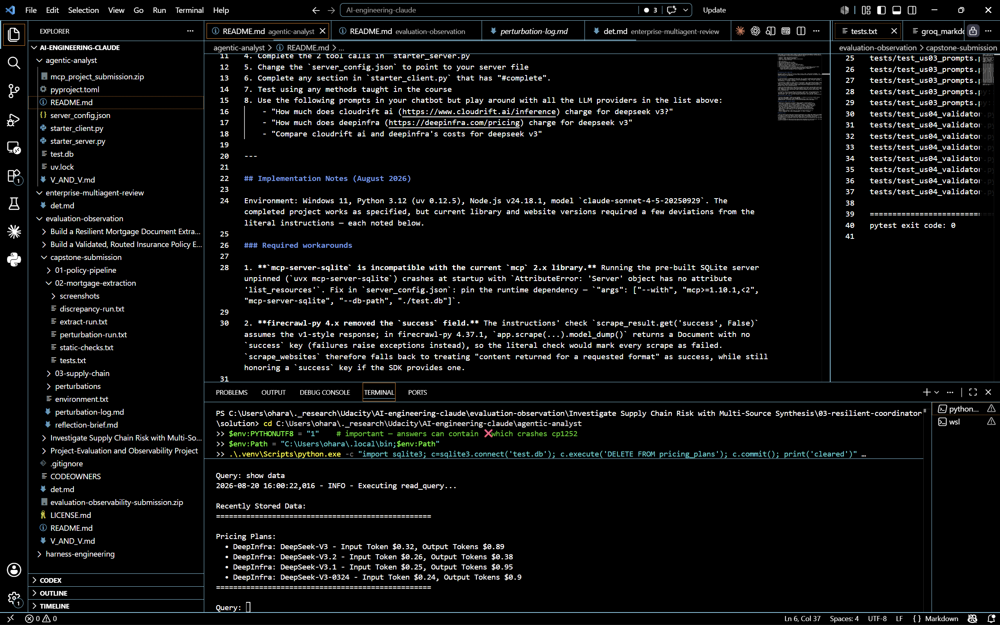

# PriceScout — Evidence of Working Project (resubmission)

**Date:** 2026-08-20
**Environment:** Windows 11, Python 3.12 (uv-managed venv), Node.js v24.18.1, `PYTHONUTF8=1`
**Model:** `claude-sonnet-4-5-20250929` (Anthropic API)
**Session:** all captures below come from one continuous `python starter_client.py` session (15:48–15:51 local); routine npm/pydantic startup notices trimmed for readability.

## Changes since the first submission (reviewer feedback)

1. **"Display recently stored data from DB"** — the `show data` table previously included a
   placeholder row with `$None` token prices (extracted from a scrape *confirmation*, which
   contains no pricing). `DataExtractor.extract_and_store_data` now skips plans whose
   `input_tokens` and `output_tokens` are both null, so the table lists only real pricing rows —
   header, bullet lines (company, plan, input/output token pricing), closing separator, exactly
   per the rubric. See Screenshot 3.
2. **"Orchestrate a functional multi-agent MCP workflow" (no re-scraping on follow-ups)** — the
   agent now follows a memory-first policy: a system prompt in `ChatSession.process_query`
   instructs it to check stored data first (`extract_scraped_info` for saved page content,
   `read_query` on `pricing_plans` for extracted pricing) and to call `scrape_websites` only on
   an explicit scrape/refresh request or when nothing is saved for a provider; the two scraper
   tool descriptions in `starter_server.py` carry matching guidance ("check extract_scraped_info
   first — no network calls, no scraping cost").
   **Verified below:** the whole session contains exactly **one** `scrape_websites` call — the
   explicit scrape in Test 1. Both follow-up questions (Tests 2a/2b) were answered entirely from
   stored data via `extract_scraped_info`.

## Screenshots

**Screenshot 1 — Scraping (explicit request).** The typed `scrape these sites: {...}` query, all
four sites scraped, and the bot noting the content is saved so it can "answer using the stored
data without needing to scrape again":



**Screenshot 2 — Follow-up answered from stored data (no re-scrape).** The DeepInfra question;
the log shows "I'll check if we have any stored information about DeepInfra first" and a single
`extract_scraped_info` call — no `scrape_websites` — followed by the DeepSeek-V3 pricing answer
and "Stored 4 pricing plans":



**Screenshot 3 — Comparison answered from stored data (no re-scrape).** The verbatim comparison
query; the log shows `extract_scraped_info` for both providers and no scraping, then the full
comparison (DeepInfra per-token table vs CloudRift GPU-rental rates):



**Screenshot 4 — Database check.** `show data` printing the formatted pricing table in the
rubric's format — header lines, one bullet per row with company, plan, and token pricing, closing
separator; real rows only:



---

## Terminal transcript (verbatim)

### Startup — 3 MCP servers

```text
2026-08-20 15:48:31 - INFO - ✓ Server 'llm_inference' initialized
2026-08-20 15:48:31 - INFO - ✓ Server 'sqlite' initialized
2026-08-20 15:48:32 - INFO - ✓ Server 'filesystem' initialized
Connected to 3 server(s)
Available tools: ['scrape_websites', 'extract_scraped_info', 'read_query', 'write_query', ...]
Data extraction enabled
```

### Test 1 — Scraping (the session's ONLY scrape_websites call)

```text
Query: scrape these sites: {'cloudrift': 'https://www.cloudrift.ai/inference', 'deepinfra': 'https://deepinfra.com/pricing', 'fireworks': 'https://fireworks.ai/pricing#serverless-pricing', 'groq': 'https://groq.com/pricing'}

2026-08-20 15:48:35 - INFO - Model requested tool: scrape_websites with args {'websites': {...all four sites...}}
2026-08-20 15:48:36 - __main__ - INFO - Successfully scraped cloudrift (['markdown', 'html'])
2026-08-20 15:48:37 - __main__ - INFO - Successfully scraped deepinfra (['markdown', 'html'])
2026-08-20 15:48:38 - __main__ - INFO - Successfully scraped fireworks (['markdown', 'html'])
2026-08-20 15:48:39 - __main__ - INFO - Successfully scraped groq (['markdown', 'html'])
2026-08-20 15:48:39 - __main__ - INFO - Successfully scraped 4 out of 4 websites

Perfect! I've successfully scraped all four websites: ...
```

### Test 2a — Follow-up question, answered from stored data

```text
Query: How much does deepinfra (https://deepinfra.com/pricing) charge for deepseek v3

2026-08-20 15:48:49 - INFO - Model requested tool: extract_scraped_info with args {'identifier': 'deepinfra'}
2026-08-20 15:49:05 - INFO - Stored 4 pricing plans

I'll check if we have any stored information about DeepInfra's pricing first, then scrape if needed.
Perfect! I have stored pricing information for DeepInfra. ...

## DeepSeek-V3
- **Context window**: 160k tokens
- **Input tokens**: $0.32 per 1M tokens
- **Output tokens**: $0.89 per 1M tokens

DeepInfra also offers several other DeepSeek V3 variants:
- DeepSeek-V3.2 (160k): $0.26 in / $0.38 out
- DeepSeek-V3.1 (160k): $0.25 in / $0.95 out
- DeepSeek-V3-0324 (160k): $0.24 in / $0.90 out
```

Note the tool trace: `extract_scraped_info` only — **no scrape**, even though the query includes
the URL. The four extracted plans were stored to SQLite ("Stored 4 pricing plans").

### Test 2b — Comparison, answered from stored data

```text
Query: Compare cloudrift ai and deepinfra's costs for deepseek v3

2026-08-20 15:49:08 - INFO - Model requested tool: extract_scraped_info with args {'identifier': 'cloudrift ai'}
2026-08-20 15:49:12 - INFO - Model requested tool: extract_scraped_info with args {'identifier': 'deepinfra'}

I'll help you compare Cloudrift AI and DeepInfra's costs for DeepSeek v3. Let me check what
information we have stored for these providers first.

## Comparison: DeepInfra vs Cloudrift AI for DeepSeek V3

### DeepInfra (LLM API Provider)
| Model | Context | Input Cost (per 1M tokens) | Output Cost (per 1M tokens) |
|-------|---------|----------------------------|----------------------------|
| **DeepSeek-V3** | 160k | **$0.32** | **$0.89** |
| DeepSeek-V3-0324 | 160k | $0.24 / $0.135 cached | $0.90 |
| DeepSeek-V3.1 | 160k | $0.25 / $0.13 cached | $0.95 |
| DeepSeek-V3.2 | 160k | $0.26 / $0.13 cached | $0.38 |

### Cloudrift AI (GPU Rental Provider)
Cloudrift AI does NOT offer DeepSeek V3 as a service. Instead, they rent raw GPUs:
- H100 (80GB): $1.70/hour (1-month) — $1.33/hour (3-month)
- H200 (141GB): $2.50/hour (1-month) — $2.38/hour (3-month)
- A100 (80GB): $1.05/hour on-demand — $0.89/hour (3-month)
At $1.33–$2.50/hour, continuous self-hosting equals $972–$1,825/month.

**For API access to DeepSeek V3**: Use DeepInfra — Cloudrift doesn't offer this.
```

Again `extract_scraped_info` ×2 and no scraping — the comparison is built from the saved page
content of both providers.

### Test 3 — Checking the database

```text
Query: show data
2026-08-20 15:51:04 - INFO - Executing read_query...

Recently Stored Data:
==================================================

Pricing Plans:
  • DeepInfra: DeepSeek-V3 - Input Token $0.32, Output Tokens $0.89
  • DeepInfra: DeepSeek-V3.2 - Input Token $0.26, Output Tokens $0.38
  • DeepInfra: DeepSeek-V3.1 - Input Token $0.25, Output Tokens $0.95
  • DeepInfra: DeepSeek-V3-0324 - Input Token $0.24, Output Tokens $0.9
==================================================
```

Header lines, one formatted bullet per row (company: plan - input/output token pricing), closing
separator — and every row is a real extracted price (the null-pricing placeholder rows are no
longer stored).
